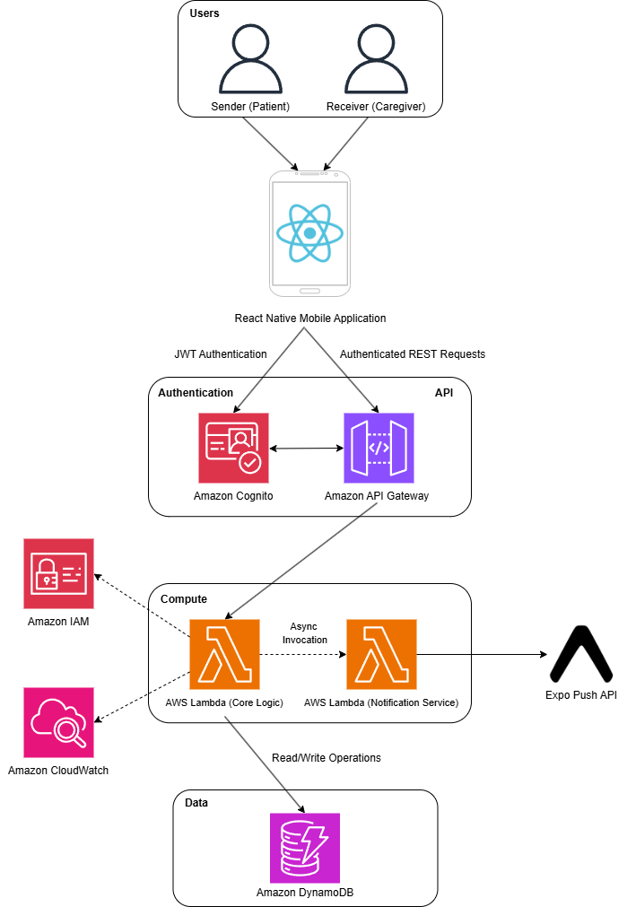
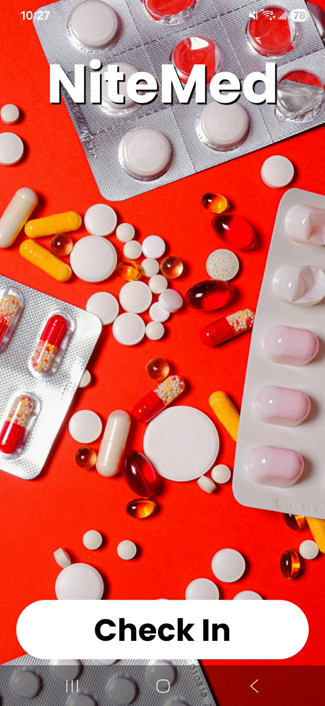
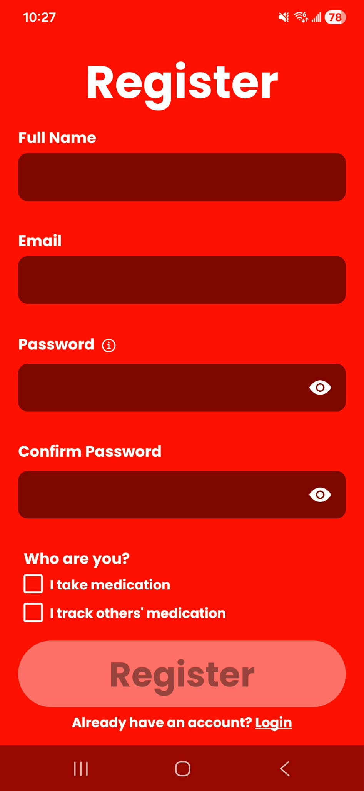
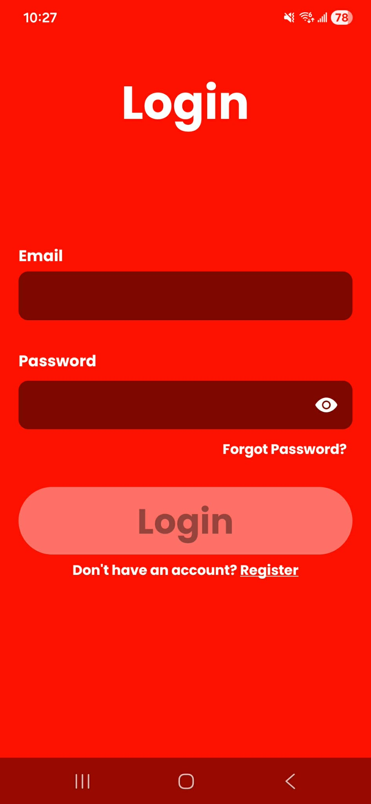
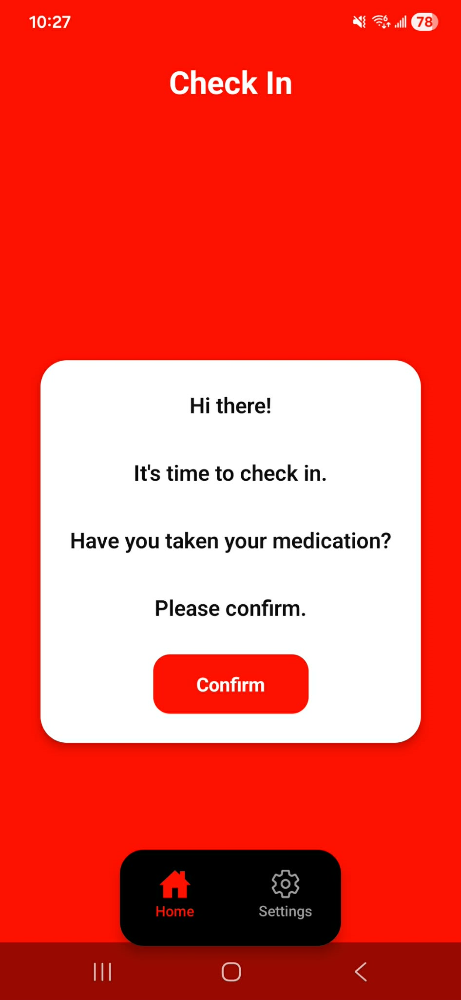
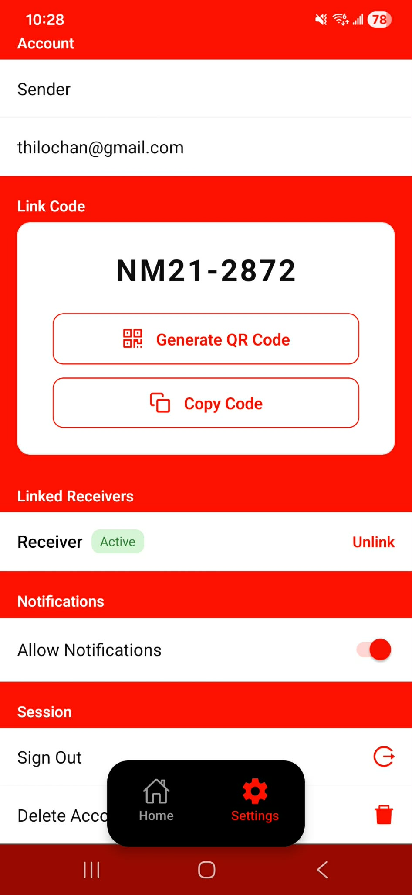
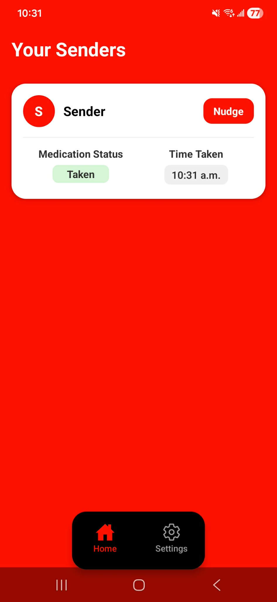
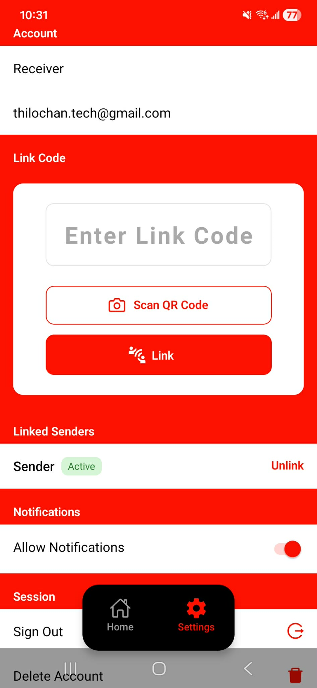

# NiteMed 💊

NiteMed is a **medication adherence tracking mobile application** designed to help caregivers monitor whether patients have taken their medication.

The app allows **patients (Senders)** to confirm when they have taken their medication and automatically notify their **caregivers (Receivers)**. This provides caregivers with peace of mind without needing to physically check on the patient.

NiteMed was built as a **full-stack mobile application** using **React Native + Expo** for the frontend and a **serverless AWS backend**.

---

## Motivation

This project was inspired by a real-world problem. My parents take medication at night and occasionally forget to take it or fall asleep before doing so. This would require me to wake them up to check whether they had taken their medication.

NiteMed simplifies this process by allowing patients to quickly confirm medication intake while giving caregivers visibility into their medication status.

---

## Features

### Role-Based Accounts

When creating an account, users choose their role:

- **Sender (Patient)** – confirms medication intake
- **Receiver (Caregiver)** – monitors medication confirmations

Based on their role, users are navigated to their respective home and settings screens.

---

### Caregiver ↔ Patient Linking

Senders are assigned a **unique link code** upon account creation.

Receivers can link to senders using:

- Copying and entering the link code
- Scanning a **QR code** generated by the sender

Once linked, caregivers can monitor medication confirmations for that sender.

---

### Medication Confirmation

Senders receive a prompt on their home screen asking them to confirm that they have taken their medication.

When confirmed:

- A notification is sent to the linked caregiver
- The caregiver's dashboard updates the sender's medication status

Receivers can see:

- Medication status (**Taken / Not Taken**)
- Timestamp of confirmation

---

### Reminder Nudges

If a receiver notices that medication has not been confirmed, they can **send a reminder nudge**.

This sends a push notification to the sender reminding them to take their medication.

---

### Push Notifications

Push notifications are used to:

- Notify caregivers when medication is confirmed
- Send reminder nudges to senders

Notifications are implemented using **Expo Push Notifications**.

---

## Tech Stack

### Frontend

- React Native
- Expo
- TypeScript
- Expo Router
- Expo Camera (QR scanning)
- Expo Notifications

### Backend (AWS Serverless)

- **AWS Cognito** – authentication and user management
- **AWS API Gateway** – REST API endpoints
- **AWS Lambda** – backend business logic
- **AWS DynamoDB** – data storage
- **AWS IAM** – secure permissions
- **AWS CloudWatch** – logging and monitoring

---

## Architecture

NiteMed uses a **serverless architecture** where the mobile application communicates with AWS services through API Gateway.

---

## Screenshots

| Start Screen                           | Register Screen                           | Login Screen                           |
| -------------------------------------- | ----------------------------------------- | -------------------------------------- |
|  |  |  |

| Sender Home                           | Sender Settings                           |
| ------------------------------------- | ----------------------------------------- |
|  |  |

| Receiver Home                           | Receiver Settings                           |
| --------------------------------------- | ------------------------------------------- |
|  |  |

---

## Author

**Thilochan Pathmanathan**

NiteMed was developed as a full-stack mobile project demonstrating experience with:

- React Native & Expo mobile development
- AWS serverless architecture (Cognito, Lambda, DynamoDB, API Gateway)
- Push notification systems
- Role-based application design

GitHub: https://github.com/t-pathmanathan
LinkedIn: https://www.linkedin.com/in/t-pathmanathan/
